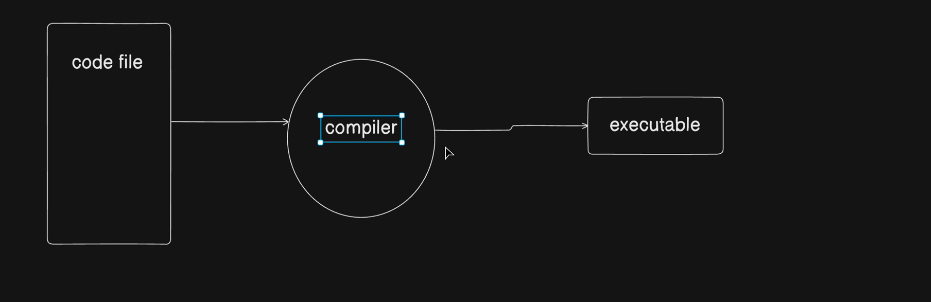

# 03 — Variables and Constants

---



---

## Notes

- Before writing any line, comments should **add value**

---

## Data Concept

- We do 3 things with data:
  1. **Store**
  2. **Process**
  3. **Display**

- Display is part of:
  - Process or Store (final output step)

---

## Data Types

- First we define **what type of data we store**

- Examples:
  - `int` → numbers
  - `string` → text
  - `array` → multiple values

---

## Data Flow

- **Data → Type → Storage → Process**

- Meaning:
  - **Store** → where we put data
  - **Process** → use data to perform task

- In programming:
  - We choose based on **scenario**

---

## Identifier

- Identifier = **variable name**

```cpp id="i4h2zp"
int score = 100;
```

- `score` → identifier

---

## Rules of Identifier

- Cannot use:
  - Data types
  - Reserved keywords

---

### Reserved Keywords (Simple)

- Predefined words in language

- Already have **special meaning**

- Example:
  - `int`, `return`, `if`, `while`

- So:
  - We **cannot use them as variable names**

---

## Naming Rule

- Variable name must be:
  - **Meaningful**

---

## Declaration vs Initialization

- **Declare** → create variable

```cpp id="yq9b2w"
int a;
```

- **Initialize** → assign value

```cpp id="qf6p9v"
a = 10;
```

- Together:

```cpp id="t1l6me"
int a = 10;
```

---

## Important Rule

- Can **re-initialize** (change value)

```cpp id="8tk3z3"
a = 20;
```

- Cannot **re-declare**

```cpp id="nq2hhs"
int a = 30; // error if already declared
```

---
