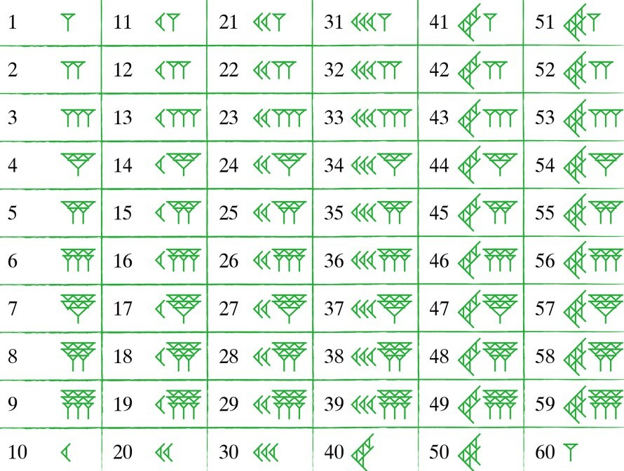
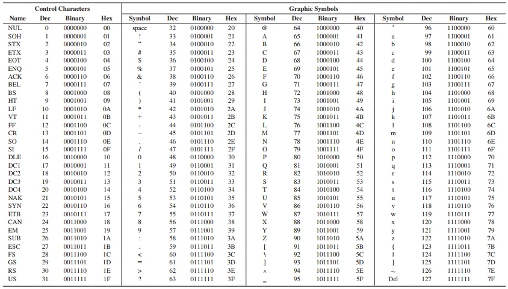
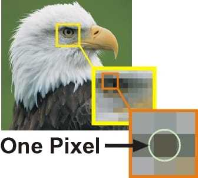

# 01. Introduction To C++

computer only understand binary `0` and `1`.
so to communicate with computer we have to use a translator who convert our language to binary and make the binary in a way the machine understand.
this translator is called a **compiler**.

---

## why computer only understand Binary ?

transistor → switch off and on.
to save `4` in computer first we convert in binary `100`.

### how computer store ?

computer store data in transistor (transistor is like a tiny switch, it has two states: ON = `1`, OFF = `0`).
to store `4` we need 3 switches for binary `100` → ON, OFF, OFF.

### how to make any number in binary

we divide by `2` repeatedly and write the remainders.

**Example — make 13 in binary by division**

- 13 ÷ 2 = 6 remainder **1**
- 6 ÷ 2 = 3 remainder **0**
- 3 ÷ 2 = 1 remainder **1**
- 1 ÷ 2 = 0 remainder **1**

write remainders bottom to top → **1101**
so `13` in binary is `1101`.

---

now how to convert binary to decimal:
from right multiply each bit by `2^position` (position starts at `0`) and sum.

**Example — convert `110011` to decimal**

positions (from right): 0 1 2 3 4 5
bits: 1 1 0 0 1 1

calculation:

- 1 × 2⁰ = 1
- 1 × 2¹ = 2
- 0 × 2² = 0
- 0 × 2³ = 0
- 1 × 2⁴ = 16
- 1 × 2⁵ = 32

sum = `1 + 2 + 0 + 0 + 16 + 32 = 51`
so `110011` (binary) = **51** (decimal).

---

## other bases

there are many number bases:

- **binary (base 2)** — digits: `0, 1`
- **octal (base 8)** — digits: `0, 1, 2, 3, 4, 5, 6, 7`
- **decimal (base 10)** — digits: `0, 1, 2, 3, 4, 5, 6, 7, 8, 9`
- **hexadecimal (base 16)** — digits: `0–9` and `A, B, C, D, E, F` (where `A = 10`, `F = 15`)

you can make any base — just need that many unique symbols.

historically there was **base 60** (used by Sumerians/Babylonians) — that had 60 unique symbols (see image).



Base 60 is originated with the ancient Sumerians in the 3rd millennium BC, passed to Babylonians, and is still used (modified) for measuring time, angles, and coordinates.

---

## how computer know where its transistor data is stored

memory is organized as a sequence of **bytes**.
each byte has an **address** (single number). CPU/RAM use addresses to read/write data.

- address `0` is the first byte, address `1` is next, and so on.
- a variable is stored at one or more byte addresses.
- a **pointer** stores an address so program can access that memory location.

so computer knows where data is because every stored byte has an address and programs use addresses/pointers to find it.

---

## how to store a character in binary

we use **ASCII** table (American Standard Code for Information Interchange).



example:

- `R` → ASCII code `82` → convert `82` to binary and store that.

ASCII has codes for basic English letters and symbols. for many other languages (hindi, bengali, chinese) we use **Unicode**.
Unicode includes ASCII as the first 128 code points, and then many more code points for other scripts.

---

## how to store an image in binary

every photo is divided in rows and columns (pixels).



- total pixels = height × width
- each pixel has a color, usually stored as **RGB** values (red, green, blue), each from `0` to `255`.
- for each pixel we store the three numbers (R, G, B) in binary.
- images can be compressed (lossless or lossy) to reduce size without or with acceptable quality loss.

same idea for audio and video (they are sampled and encoded into binary).

---

## now we move to C++

are `cin` and `cout` part of C++?

- `cin` and `cout` are provided by the C++ **standard library** in header `<iostream>`.
- they are not part of the very core language grammar, but they are standard library facilities used in C++ programs.

example:

```cpp
int main() {
  int a = 10;
  float b = 3.14f;
  return 0;
}
```

this code compiles and runs.

---

## basic data types

- `int` → 1, 2, 3, 45
- `float` → 1.2, 3.6, 52.6, 5.5
- `char` → `'a'`, `'b'`, `'c'`
- `string` → `"kase ho ap"`

we tell computer the type so it knows how to store the data:

```cpp
int a = 10;     // integer
float b = 3.14; // float
char c = 'x';   // character
string s = "hello";
```

to print and take input we include the iostream header where `cin` and `cout` are defined:

```cpp
#include <iostream>
using namespace std;

int main() {
  int a = 10;
  float b = 6.2;
  cout << b << endl;
  std::cout << a << std::endl;
  return 0;
}
```

C++ is heavily used in backend, game dev, trading systems — places where speed matters. In those contexts we don't normally use `cin`/`cout` for IO (use faster or specialized IO).

a popular library in C++ is **STL** (Standard Template Library) — containers, algorithms, etc.

you can create your own library too.

---

## why iostream is not in "original C++" core?

C++ language core defines syntax and types (`int`, `float`, control flow). Standard library (like `<iostream>`) is separate to keep language specification and implementation modular. library code lives in headers and implementations provided by compiler vendors.

---

## executable and return value

C++ code is compiled to machine code (on Windows you get `.exe`).

`return 0;` from `main()` tells OS that program ended successfully. `main` returns an `int`, so we return `0` for success.

---

## memory size and sizeof

you can find how much memory a type uses with `sizeof`.

- `1 byte = 8 bits`
- common `int` size on many systems is `4 bytes` (32 bits), but it is **implementation dependent** (not guaranteed by standard). use `sizeof(int)` to check on your system.
- when numbers exceed range of `int`, use `long long`.

example:

```cpp
#include <iostream>
using namespace std;

int main() {
  int a = 10;
  float b = 6.2;
  cout << b << endl;
  std::cout << a << std::endl;
  string name = "Tera bhai he KING";
  cout << name << endl;
  cout << name.length();
  return 0;
}
```

this stores and prints the `name` string.

---
