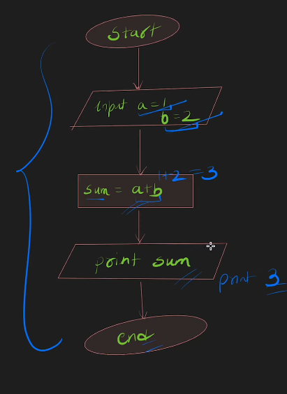
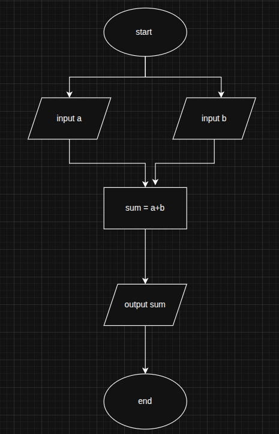
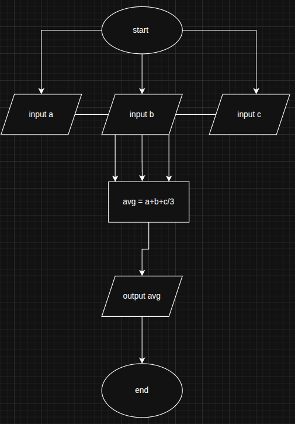
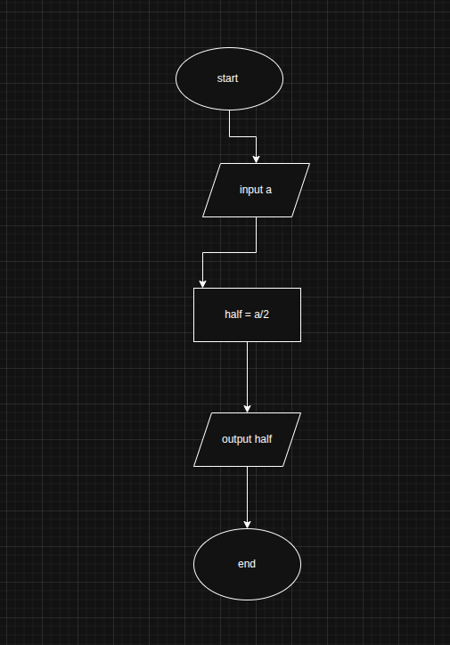
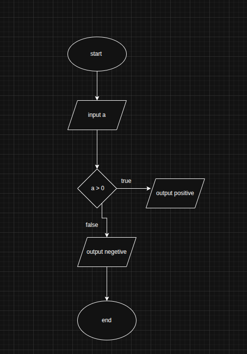
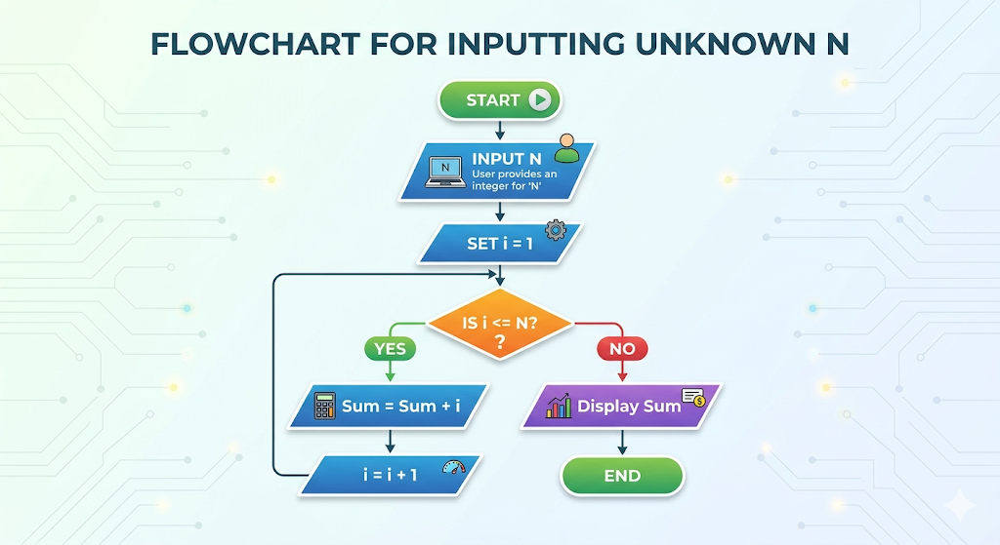
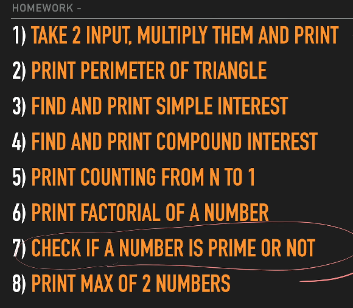

# Lecture 1: Flowchart & Pseudocode + Basics

---

## What is Programming

- A computer does a set of tasks based on commands
- It can be:
  - Image processing
  - Addition
  - Permutation
  - Anything

---

## What is Algorithm

- It is a set of **step-by-step instructions** to complete a task

---

## How to Approach a Problem

- **Step 1**
  - Understand the problem
  - What it tells and what it wants

- **Step 2**
  - Write input values

- **Step 3**
  - Approach / solve the problem

---

## What is Flowchart

- It is a **diagram format of an algorithm**



---

## Flowchart Shapes

- **Oval (Terminator)**
  - Used for **Start / End**

```
 ( Start / End )
```

- **Parallelogram**
  - Used for **Input / Output**

```
  / Input Output /
```

- **Rectangle**
  - Used for **Processing / Operation**

```
 [ Process ]
```

- **Diamond**
  - Used for **Decision (Condition check)**

```
   < Decision >
```

---

## What is Pseudocode

- Writing logic in **human understandable language**
  - English / Hindi

---

## Sum of 2 Numbers



### Pseudocode

```
start
take 2 numbers
sum the numbers and store in sum
print the sum
end
```

---

## Average of 3 Numbers



### Pseudocode

```
start
input 3 numbers
average of 3 numbers store in avg
print the output
end
```

---

## Half of a Number



### Pseudocode

```
start
input a
make it half
output the half
end
```

---

## Check Positive or Negative



### Pseudocode

```
start
read the number
if number > 0
  output positive
else
  output negative
end
```

---

## Looping

- We do a task **multiple times** until a condition is met

---

## Print Count from 1 to N

- When we don’t know N, we take it as input



### Pseudocode

```
start
take n input
create variable i = 1
while i <= n
  print i
  increase i
end
```

---

## Homework

- Solve the given problem from image:



---
