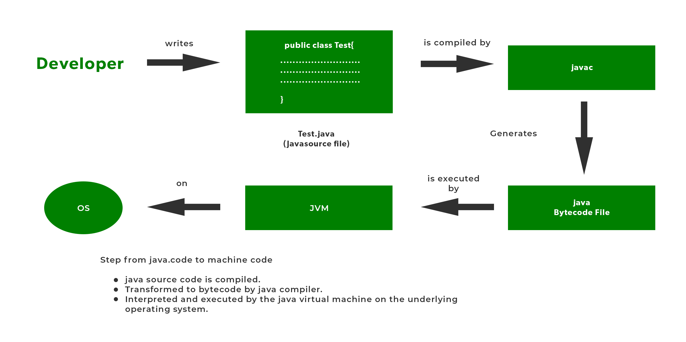
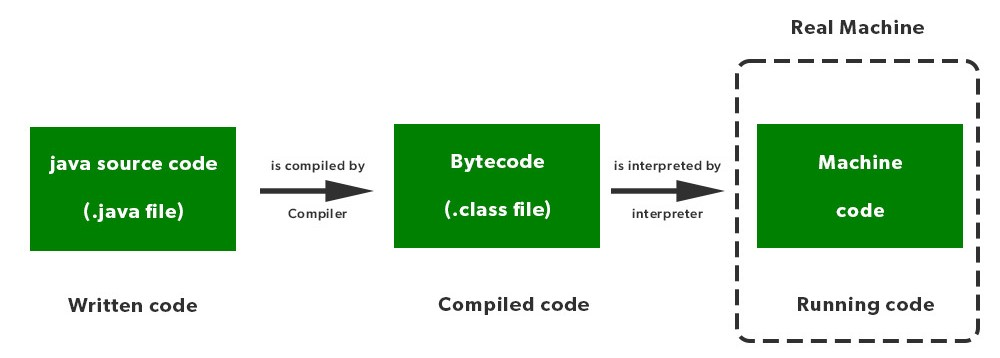

# Lecture-02: How a Java Program Runs

---

## Basic Idea

- Java code is written and stored in **`.java` file**
- It does not directly convert into machine code

---



### Java Compiler

- Converts:
  - `.java` → `.class` (**bytecode**)

- Bytecode:
  - **Machine independent**
  - Can run on any OS

---



### Java Interpreter (JVM)

- JVM executes the **bytecode**
- Converts bytecode → **machine understandable code**
- Makes Java **platform independent**

---

## Compiler vs Interpreter (Difference)

- **Compiler**
  - Converts whole code at once
  - Output: **bytecode (.class)**

- **Interpreter (JVM)**
  - Executes code line by line (internally optimized)
  - Converts bytecode → **machine code**

---

## Java Bytecode

- Intermediate code between:
  - Source code
  - Machine code

- Same bytecode:
  - Runs on **any OS**

---

## JVM (Java Virtual Machine)

- Work:
  - Runs `.class` (bytecode)
  - Converts it into machine code

- Note:
  - Compiler creates bytecode
  - JVM executes it

---

## JIT (Just-In-Time Compiler)

- Part of JVM

- Work:
  - Converts frequently used bytecode into **native machine code**
  - Improves performance (faster execution)

---

## JRE (Java Runtime Environment)

- Combination of:
  - **JVM**
  - **Libraries**

- Meaning:
  - Provides environment to **run Java programs**

---

## JDK (Java Development Kit)

- Used to:
  - **Develop + Run** Java programs

- Contains:
  - JRE
  - Development tools (compiler etc.)

---

## Structure

```id="8qwh8x"
JDK → JRE → (JVM + Libraries)
```

---

## Correct Flow of Java Program

```id="x4s1qv"
.java file
   ↓ (Compiler)
.class (Bytecode)
   ↓ (JVM)
Machine Code (OS dependent)
   ↓
Execution
```

---

## Home Work

### **Questions**

1. What is JIT?
2. Difference between compiler and interpreter
3. Java is which type of language?

---

### **Answers**

**1. What is JIT?**
JIT (Just-In-Time Compiler) is a part of the JVM that converts frequently used bytecode into native machine code at runtime to improve performance.

---

**2. Difference between Compiler and Interpreter**
A compiler translates the entire program into machine code at once, making execution faster.
An interpreter translates and executes the program line by line, which is slower but helps in identifying errors easily.

---

**3. Java is which type of language?**
Java is both a compiled and an interpreted language.
It is compiled into bytecode first, and then the JVM interprets it and uses JIT to convert frequently used code into machine code for faster execution.

---

## Summary

- `.java` → compiled → `.class` (bytecode)
- JVM runs bytecode
- JIT improves speed
- JDK = full package
- JRE = runtime
- JVM = execution engine

---
